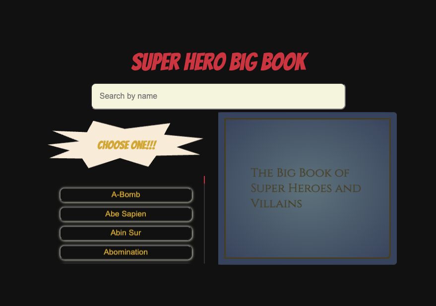

# Portfolio

### Preview:

### Things I learned:

- Stacking classnames in CSS modules
- Using `z-index` and `transition-duration` to make things stack correctly while animating
- More advanced animations
- More advanced uses for `position: absolute`
- Using the NextJS API routes to control `CORS` issues
- A little about working with `clip-path`
- More intricacies with React & NextJS

---

### Challenges I faced while building this:

1. Getting the page flip animation to stack correctly each direction.
2. Using NextJS API routes to call external APIs is not super intuitive but we got there.
3. Figuring out how to properly use and API that is not sending reliably structured information consistently
4. How to set up a fallback image
5. Making it animate and show all content correctly while maintaining responsiveness

---

### Tech I used:

---

### Things I'm proud of:

- I finished it!
- It's fun!
- The animation is doing exactly what I want it to do
- I conquered this poorly put together API (no offense to the creator)
- This really didn't take very much actual coding time
